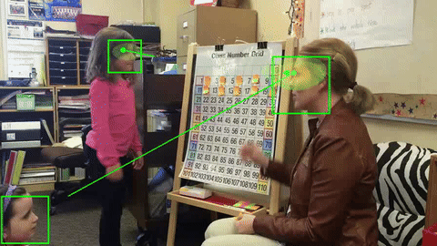
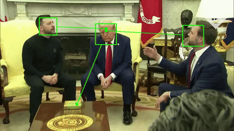

# GazeMoE: Gaze Estimation with Mixture-of-Experts

[](LICENSE)





---

GazeMoE is a state-of-the-art gaze estimation model (14MB decoder) built on top of a frozen **DINOv2 Vit-L/14** backbone. It uses a Mixture-of-Experts (MoE) transformer decoder to predict whether a person's gaze target is inside or outside the camera frame and generates a heatmap for the gaze location.

## Quick Start

### 1. Requirements

To develop and train GazeMoE, please checkout **main** branch and follow the prerequisites of GT360 system. To simply run GazeMoE, you only need

```bash
pip install torch torchvision timm huggingface_hub numpy Pillow

```

### 2. Hello World Example

We release the pre-trained GazeMoE model on [HuggingFace](https://huggingface.co/zdai257/GazeMoE) (finetuning on VideoAttentionTarget dataset)!

This script downloads the weights from *HuggingFace*, initializes the model (including the auto-download of DINOv2), and runs inference on a single input.

```python
import torch
import numpy as np
from PIL import Image
from huggingface_hub import hf_hub_download
from network.gazemoe_builder import get_gazemoe_model

# --- 1. Load Model & Weights ---
device = "cuda" if torch.cuda.is_available() else "cpu"
model, transform = get_gazemoe_model()

# Download custom 14MB weights from Hugging Face
weights_path = hf_hub_download(repo_id="zdai257/GazeMoE", filename="GazeMoE.pt")
state_dict = torch.load(weights_path, map_location=device)
model.load_gazemoe_state_dict(state_dict)
model.to(device).eval()

# --- 2. Prepare Input ---
# GazeMoE expects: 
# - images: [B, 3, 448, 448] tensor
# - bboxes: A list of lists containing [xmin, ymin, xmax, ymax] normalized (0-1)
raw_image = Image.open("example.jpg").convert("RGB")
w, h = raw_image.size

# Example: One person with a head bounding box (normalized)
# Format: [xmin, ymin, xmax, ymax]
example_bbox = [0.4, 0.2, 0.55, 0.4] 

inputs = {
    "images": transform(raw_image).unsqueeze(dim=0).to(device),
    "bboxes": [[example_bbox]] 
}

# --- 3. Inference ---
with torch.no_grad():
    preds = model(inputs)

# --- 4. Process Outputs ---
# 'inout' predicts if the gaze is Inside (IFT) or Outside (OFT) the frame
inout_prob = preds['inout'][0][0].item() 

if inout_prob < 0.5:
    print(f"Gaze is OUT-OF-FRAME (Prob: {inout_prob:.2f})")
else:
    print(f"Gaze is IN-FRAME (Prob: {inout_prob:.2f})")
    
    # Heatmap is 64x64. Get the (x, y) via argmax
    heatmap = preds['heatmap'][0][0].cpu().numpy()
    
    argmax = heatmap.flatten().argmax()
    pred_y, pred_x = np.unravel_index(argmax, (64, 64))
    
    # Normalize coordinates to 0-1
    x_norm, y_norm = pred_x / 64.0, pred_y / 64.0
    
    print(f"Estimated Gaze Target (Normalized): x={x_norm:.2f}, y={y_norm:.2f}")
    print(f"Pixel Coordinates: X={x_norm * w:.1f}, Y={y_norm * h:.1f}")

```

---

### 3. Input Format

The model consumes a dictionary:

* **`images`**: A `torch.Tensor` of shape `(Batch, 3, 448, 448)`. Use the `transform` provided by the factory function to ensure correct normalization and resizing.
* **`bboxes`**: A list of lists. Each sub-list corresponds to an image in the batch and contains the head bounding box proposals in **normalized coordinates** .

### 4. Outputs

The model returns a dictionary with two keys:

1. **`inout`**: A sigmoid output. Values  indicate the person is looking at something outside the image boundaries.
2. **`heatmap`**: A  spatial map. The gaze target is typically identified by taking the `argmax` of this map to find the peak intensity coordinate.

---

## Citation

If you use our work, please cite:

```bibtex
@INPROCEEDINGS{gazetarget360_iros2025,
  author    = {Dai, Zhuangzhuang and Zakka, Vincent Gbouna and Manso, Luis J. and Li, Chen},
  booktitle = {IEEE/RSJ International Conference on Intelligent Robots and Systems (IROS)}, 
  title     = {GazeTarget360: Towards Gaze Target Estimation in 360-Degree for Robot Perception}, 
  year      = {2025},
  address   = {Hangzhou, China}
}

@INPROCEEDINGS{gazemoe_icra2026,
  title     = {GazeMoE: Perception of Gaze Target with Mixture-of-Experts},
  booktitle = {Proceedings of the IEEE International Conference on Robotics and Automation (ICRA)},
  year      = {2026},
  publisher = {IEEE},
  address   = {Vienna, Austria}
}
```
---

## Acknowledgements

Experiments were run on Aston Engineering and Physical Science Machine Learning Server, funded by the EPSRC Core Equipment Fund, Grant EP/V036106/1.

The authors would like to acknowledge support by Villum Experiment project (00058627).
